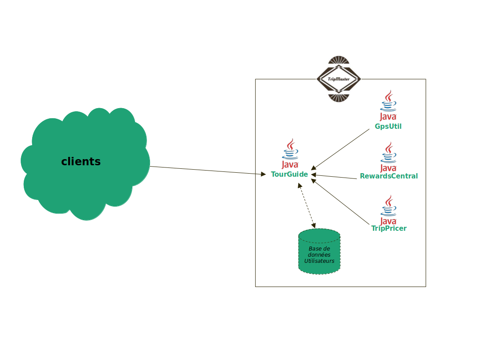

# TourGuide

TourGuide is a Openclassrooms project.

The application suggests attractions to users based on their location.<br>
Deals are applied depending on the attraction visited.

She used external libraries from TripMaster Group.



## Installation

This application was developed with Java OpenJDK 8 and Gradle 4.8.1

You can build and test application with command `./gradlew check`

## Endpoints

> __GET__ - / - Index

> __GET__ - /getLocation?userName=< username > - Get the user location

> __GET__ - /getNearByAttraction?userName=< username > - Get the five closest attractions

> __GET__ - /getRewards?userName=< username > - Get the user rewards

> __GET__ - /getAllCurrentLocations - Get the latest visited location from all users.

> __GET__ - /getTripDeals?userName=< username > - Get the user providers

> __POST__ - /users/updatePreferences?userName=< username > - Post updated user's preferences.
> 
> Request body: application/json <br>
> Exemple value:
> 
> ```json 
> {
>    "attractionProximity": 120,
>    "currency": "EUR",
>    "lowerPricePoint": 0.0,
>    "highPricePoint": 500.0,
>    "tripDuration": 2,
>    "ticketQuantity": 3,
>    "numberOfAdults": 2,
>    "numberOfChildren": 1
> }
> ```
> Responses:
> 
> | Code | Description                      |
> |------|----------------------------------|
> | 200  | User preferences updated         |
> | 400  | Unknown user or body malformed   |
> 

